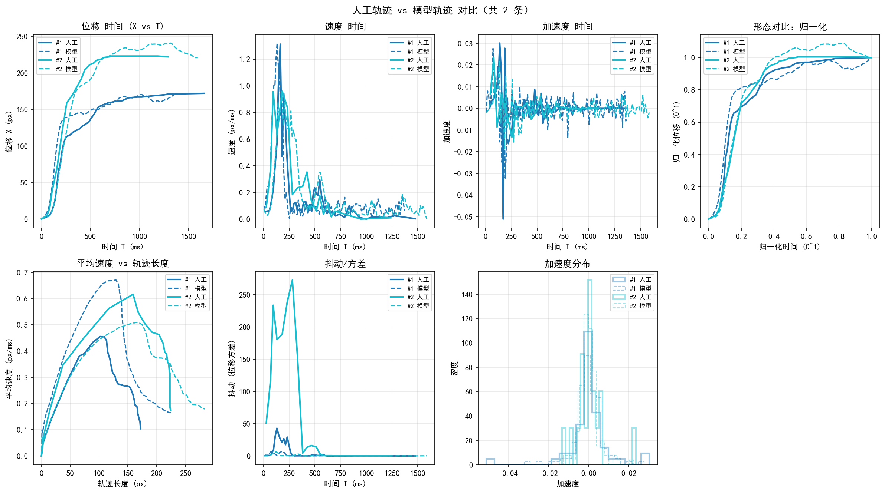

## 项目简介

本仓库实现了一个**生成滑块验证轨迹的条件 WGAN-GP 模型**，目标是在给定目标距离（滑块需要移动的像素距离）时，生成一条在**几何形状、速度曲线、加速度特征、抖动分布**等方面都尽量接近真人操作的轨迹，用于：

- **防刷/风控**：生成更“像人”的滑块拖动轨迹。
- **模型研究**：分析人类滑块行为的统计特征，并用生成模型进行拟合与对比。
- **跨端部署**：通过 ONNX 导出和 `onnxruntime` 在后端或其他语言环境中推理。

核心流程：

1. 前端 `web/index.html` 采集真实滑块轨迹，导出为 JSON。
2. `dataset/io.py` + `dataset/preprocess.py` 将轨迹重采样为**固定长度、等时间间隔**的 `(dx, dy)` 序列，并归一化。
3. `model/wgan.py` 定义条件 WGAN-GP：`Generator` 生成轨迹增量序列，`Discriminator` 判别“真人 vs 模型”。
4. `train.py` 在多种**物理与几何约束 Loss**下训练生成器，使其输出轨迹在统计特征上逼近真人。
5. `inference.py` 负责给定目标距离，利用训练好的生成器生成完整的 `{x,y,t}` 轨迹。
6. `export_onnx.py` + `example/onnx_runtime_demo.py` 演示如何导出并用 ONNXRuntime 推理。
7. `validate.py` 与对比绘图脚本一起，对生成轨迹与真人轨迹在**多维指标上做对比可视化与行为校验**。

下文将分模块详细介绍整个算法与实现细节。

---

## 数据采集与标注格式

### 前端采集页面

文件：`web/index.html`

- 页面展示一个典型的“拖动滑块到缺口处”的组件。
- 用户每次成功拖动到缺口，记录一次**完整轨迹**：
  - 轨迹格式：`points: [{ x, y, t }, ...]`
    - `x`：当前滑块左侧像素位置。
    - `y`：垂直方向像素位置（滑块为水平运动，理论上接近 0，但允许轻微抖动）。
    - `t`：从按下开始的相对时间（毫秒）。
  - `targetDistance`：目标距离（px），即缺口相对起点的水平距离。
- 支持：
  - **批量导出数据集**：`trajectory_dataset.json`（数组形式）。
  - **导出 compare 用数据**：`index.json`（可以是单条，也可以是 `{ trajectories: [...] }`）。

采集得到的单条样本 JSON 结构如下：

```json
{
  "targetDistance": 186,
  "points": [
    { "x": 0, "y": 0, "t": 0 },
    { "x": 3, "y": 0, "t": 18 },
    ...
  ]
}
```

数据放置方式：

- 训练集目录：`dataset/train/*.json`
- 对比/验证集目录：`dataset/compare/index.json`（前端导出的 compare 文件）。

---

## 数据预处理与序列构建

### IO 层：从 JSON 到样本

文件：`dataset/io.py`

- **`load_sample(obj)`**：从单条 JSON 对象构造 `(D, points)`：
  - `D`：`targetDistance`，单位 px。
  - `points`：原始 `{x,y,t}` 序列。
- **`load_json_file(path)`**：
  - 兼容：
    - 数组形式：`[ {targetDistance, points}, ... ]`
    - 单对象形式：`{targetDistance, points}`
  - 返回：`[(D, points), ...]`。
- **`load_dataset(dir_path)`**：
  - 扫描目录下所有 `.json`，汇总为训练样本列表。

> 注意：历史上还有 `points_to_deltas` (dx, dy, dt) 的接口，但 v2 模型已改为**时间重采样 + 固定 dt**，不再直接使用 dt 作为输入特征。

### 预处理：等时间重采样 + 归一化

文件：`dataset/preprocess.py`

主要常量：

- **`SEQ_LEN = 128`**：模型输入/输出序列统一为 128 步，时间分辨率更高。
- **`DATA_DIM = 2`**：每个步长只包含 `(dx, dy)`，不再包含 `dt`。
- **`NORM_SCALE = 10.0`**：`dx, dy` 的统一归一化尺度。
- **`D_MAX = 400.0`**：最大目标距离（px），用于将 `targetDistance` 归一化到 \[0, 1\]。
- **`DT_MS = 10.0`**：推理时的**默认时间步长**（ms），训练时不显式使用。

关键函数：

- **`resample_trajectory(points, target_len=SEQ_LEN)`**：
  - 输入：原始 `points: [{x,y,t}, ...]`。
  - 步骤：
    1. 将时间 `t` 归一化到均匀时间轴 `new_t`（`target_len + 1` 个采样点）。
    2. 对 `x, y` 在 `new_t` 上做线性插值，得到 `new_x, new_y`。
    3. 计算等时间间隔的增量：
       - `dx = new_x[1:] - new_x[:-1]`
       - `dy = new_y[1:] - new_y[:-1]`
    4. 统一按 `NORM_SCALE` 归一化，得到 `seq: (target_len, 2)`。
    5. 条件 `cond` 为**归一化目标距离**：
       - `target_dist = clip((x[-1] - x[0]) / D_MAX, 0.0, 1.0)`。
  - 输出：
    - `cond: shape (1,)`，即 `[D_norm]`。
    - `seq: shape (SEQ_LEN, 2)`，为归一化后的 `(dx, dy)`。

- **`sample_to_sequence(sample, max_len=SEQ_LEN)`**：
  - `sample` 为 `(D, points)`，内部直接调用 `resample_trajectory`。

- **`prepare_batches(samples, max_len=SEQ_LEN, batch_size=32, shuffle=True)`**：
  - 将多个样本转换为 `(conds, seqs)`，并做 shuffle + batch 切分：
    - `conds: (B, 1)`
    - `seqs: (B, SEQ_LEN, 2)`

> 设计要点：
>
> - 通过**等时间重采样**，把原来的不规则时间间隔编码到 `dx` 的分布中。
> - 训练时模型只需要学习 `(dx, dy)` 在固定步长下的统计形态，推理时则**重建一个等间隔时间轴**即可间接还原“速度变化”。

---

## 模型结构：条件 WGAN-GP

文件：`model/wgan.py`

### 条件生成器 `Generator`

签名：

```python
Generator(
    latent_dim=64,
    cond_dim=1,
    max_len=128,
    hidden=128,
    step_noise_dim=32,
    step_noise_alpha=0.4,
)
```

输入 / 输出：

- 输入：
  - `z: (B, 64)`：高维潜在向量，提供全局随机性。
  - `c: (B, 1)`：条件向量 `D_norm`，即目标距离 / `D_MAX`。
- 输出：
  - `seq: (B, max_len, 2)`：归一化 `(dx, dy)` 序列。

内部结构：

1. **条件投影层 `proj`**：
   - 将 `[z, c]` 拼接后映射到隐藏维 `hidden`，并通过两层 `Linear + LeakyReLU` 提升表达能力。
   - 得到的向量复制到每个时间步，形成 `(B, L, H)`。
2. **位置嵌入 `pos_embedding`**：
   - 使用 `nn.Embedding(max_len, hidden)` 为每个时间步提供一个**可学习的位置编码**。
   - 与条件投影相加，形成具有时间位置信息的序列输入。
3. **逐步噪声 `step_noise`（局部随机性）**：
   - 使用 `step_noise_dim` 维的高斯噪声，通过 `step_noise_proj` 映射到 `hidden` 维。
   - 再以系数 `step_noise_alpha` 加到 LSTM 输入上：
     - 使轨迹在局部也有随机性，避免只输出“平均轨迹”。
   - 导出 ONNX 时可通过 `G.step_noise_alpha = 0` 关闭此通道，以避免随机算子。
4. **双层 LSTM**：
   - `nn.LSTM(hidden, hidden, num_layers=2, batch_first=True)`。
   - 建模序列依赖，使局部步长、加速度、抖动等在时间上更平滑自然。
5. **输出头 `out`**：
   - 线性层映射到 64，再到最终输出维度 2 (`dx, dy`)。

整体上，`Generator` 是一个**条件序列生成模型**：在给定目标距离和全局噪声的前提下，生成一条固定长度、局部有随机抖动的二维位移序列。

### 判别器 `Discriminator`

签名：

```python
Discriminator(max_len=128, cond_dim=1, channels=(32, 64, 128))
```

输入 / 输出：

- 输入：
  - `seq: (B, max_len, 2)`：轨迹增量。
  - `c: (B, 1)`：条件（归一化距离）。
- 输出：
  - `score: (B, 1)`：WGAN 风格的**实数评分**，越大越像真人。

结构：

1. 条件拼接：
   - 将 `c` 在时间维上扩展，并与 `seq` 在特征维上拼接：
     - `(B, L, 2+1)`。
2. 1D 卷积堆叠：
   - 多层 Conv1d + LeakyReLU。
   - 第一层 `stride=1`，更敏感于局部细节；后续层 `stride=2` 下采样以捕获长程结构。
3. 自适应池化 + 全连接：
   - `AdaptiveAvgPool1d(1)` 聚合时间维。
   - 最终 `fc` 输出单个评分。

判别器负责捕捉：

- 是否平滑起步、加速、减速。
- 是否存在异常的大回撤或“瞬移”。
- 抖动是否符合人类特征。
- Y 轴偏移是否正常（略有抖动但不剧烈偏移）。

---

## 训练算法与损失设计

文件：`train.py`

训练采用 **WGAN-GP** 框架，并在生成器端加入一系列定制的**辅助损失**，约束轨迹的几何与物理属性。

### WGAN-GP 主体

- 判别器损失：
  - `d_loss = E[D(fake)] - E[D(real)] + λ_gp * GP`
  - 其中 `GP` 为梯度惩罚（gradient penalty）。
- 生成器对抗损失：
  - `loss_adv = -E[D(gen_seq)]`。

### 轨迹辅助损失 `OptimizedTrajectoryLoss`

文件内类：`OptimizedTrajectoryLoss`。

输入：

- `fake_seq: (B, L, 2)`：生成轨迹的增量 `(dx, dy)`。
- `cond: (B, 1)`：目标距离条件。
- `args`：训练配置（各损失权重、窗口大小等）。

中间量：

- `x_cum, y_cum`：对 `dx, dy` 逐步累加得到的**绝对坐标轨迹**。
- `vel, accel, jerk`：一阶、二阶、三阶导数，用于刻画速度、加速度与变化平滑度。

包含的损失分量：

1. **几何对齐损失 (`loss_geom_x`, `loss_geom_y`)**：
   - `x` 方向：
     - `x_cum[:, -1]` 应接近目标距离 `target_val`。
   - `y` 方向：
     - 终点 `y_cum[:, -1]` 应尽量回到 0 附近，惩罚垂直方向残差。
2. **平滑度损失 (`loss_smooth`)**：
   - 对三阶导 `jerk` 的平方求均值，惩罚突然加加速度变化，保持轨迹更自然。
3. **Y 轴加速度惩罚 (`loss_accel_y`)**：
   - 惩罚 `a_y` 的方差，避免竖直方向“抽动”过强。
4. **Y 轴漂移范围约束 (`loss_y_range`)**：
   - 计算 `y_cum` 的范围 `y_range = max(y) - min(y)`。
   - 限制其不超过一定阈值 `margin_y`，防止轨迹在垂直维上飘得太远。
5. **回撤损失 (`loss_drawdown`)**：
   - 计算 `x_cum` 的运行最大值 `run_max` 与当前值的差 `dd = run_max - x_cum`。
   - 惩罚超过一定像素的回撤，模拟真人虽有小回拉但不会大幅退回。
6. **分散度损失 (`loss_spread`)**：
   - 约束单步最大位移在整个路径中的比例不宜过高，避免出现少数几步“大跨步”。
7. **终点减速 / 停止平滑 (`loss_stop`)**：
   - 对最后 10% 时间步的速度做平方惩罚，使末尾速度逐渐减小，模拟**对准缺口时的减速停顿**。
8. **抖动约束 (`loss_jitter`)**：
   - 使用滑动窗口内的步长 `ds = sqrt(dx^2 + dy^2)` 的方差作为“抖动强度”。
   - 目标是在一定范围内（例如约 0.5）约束抖动程度，既不过于死板，也不过于凌乱。

总辅助损失为各项加权和：

- `total_aux_loss = λ_geom * (...) + λ_smooth * loss_smooth + λ_acc * loss_accel_y + λ_drawdown * loss_drawdown + λ_spread * loss_spread + λ_jitter * loss_jitter + ...`

生成器最终损失：

- `total_g_loss = loss_adv + total_aux_loss + 0.05 * loss_diversity`
- 其中 `loss_diversity` 利用 batch 内样本的距离矩阵，鼓励轨迹之间存在差异，防止“塌缩到单一模式”。

训练过程中的实践要点：

- 使用 **WGAN-GP** 而非标准 GAN，改善收敛性。
- 对生成器参数做 **梯度裁剪**（`clip_grad_norm_`），防止 LSTM 梯度爆炸。
- 定期保存检查点：
  - 中间：`wgan_v2_epoch{N}.pt`
  - 最终：`wgan_v2_final.pt`，并复制为 `wgan.pt` 供推理与对比模块使用。

---

## 推理算法与轨迹重建

文件：`inference.py`

目标：给定目标距离 `target_distance`，生成一条完整的 `{x,y,t}` 轨迹。

### 加载生成器

- **`load_generator(checkpoint_path)`**：
  - 构造 `Generator(max_len=SEQ_LEN)` 并加载 `wgan.pt` 中的生成器权重。
  - 支持两种 checkpoint 结构：
    - `{"G": state_dict, "D": ...}`
    - 直接是 `state_dict`。

### 时间估计与抖动噪声

- **`_estimate_duration_ms(target_distance)`**：
  - 根据经验统计，给目标距离估一个典型总用时：
    - 例如约：200px ≈ 1200–1800ms，50px ≈ 600–1000ms。
  - 这里采用线性经验公式，并设置下界约 400ms。

- **`_colored_noise(n, std, alpha)`**：
  - 构造 AR(1) 相关噪声，模拟“有惯性”的微抖动，而非完全独立高斯白噪声。
  - 用于给 `(dx, dy)` 增量加入更符合人类手部运动的局部扰动。

### 核心函数：`generate_trajectory`

签名（简化）：

```python
generate_trajectory(
    G,
    target_distance,
    seed=None,
    add_jitter=True,
    jitter_std_px=2.0,
    jitter_alpha=0.85,
    clip_dx_min_px=-2.0,
    clip_dx_max_px=None,
    force_monotone_x=False,
) -> list[{"x": float, "y": float, "t": float}]
```

处理流程：

1. **条件构造与网络前向**：
   - 归一化距离：`D_norm = clip(target_distance / D_MAX, 0, 1)`。
   - 构造 `cond = [[D_norm]]`，`z ~ N(0,1)`。
   - 前向得到 `seq: (SEQ_LEN, 2)`，再按 `NORM_SCALE` 反归一化为 `(dx, dy)`。
2. **步长约束与第一次累加**：
   - 可选夹紧单步水平位移：
     - `clip_dx_min_px` 保证不会出现极端负值，避免大规模回退。
     - `clip_dx_max_px`（若设定）限制单步最大前进距离。
   - 对 `(dx, dy)` 累加得到 `x, y`，此时总距离约为 `total_x`。
3. **终点对齐（缩放）**：
   - 若 `total_x` 过小，则退化为等步长线性插值。
   - 否则对 `dx` 等比缩放，使最终 `x[-1]` 精确为 `target_distance`。
4. **加入手抖噪声并重新缩放**：
   - 若开启 `add_jitter`：
     - 在缩放之后对 `dx, dy` 加入 AR(1) 噪声。
     - 再重新累加得到新的 `x, y`，并做一次全局缩放，确保终点仍为 `target_distance`。
5. **可选强制单调**：
   - 如果希望完全没有回撤，可启用 `force_monotone_x`：
     - 对 `x` 做 `np.maximum.accumulate`，并再次缩放到终点。
6. **时间轴重建**：
   - 使用 `np.linspace(0, total_time, n)` 构造线性时间轴。
   - 中间时间点加入 ±1ms 的轻微抖动。
   - 最终使用单调累积保证时间严格递增。
7. **输出轨迹**：
   - 组合成 `{x, y, t}` 列表返回。

> 对比训练阶段：
>
> - 训练时：已用等间隔重采样，所以 `dx` 自身隐含“速度变化”信息。
> - 推理时：再构造等间隔时间轴即可，从而保持训练时学到的**速度分布形态**，不再额外用幂函数 warp 时间。

### 高层接口

- **`generate_and_save(checkpoint_path, target_distance, out_path, seed=None)`**：
  - 直接生成轨迹并保存为 JSON：
    - 结构：`{ "targetDistance": D, "points": [...] }`。

---

## ONNX 导出与推理

### 导出为 ONNX

文件：`export_onnx.py`

核心函数：`export_onnx(...)`：

- 加载 PyTorch `Generator` 权重。
- 默认**关闭逐步噪声**（`step_noise_alpha = 0`），以避免 ONNX 中的随机算子。
- 导出接口：
  - 输入：
    - `z: (B, 64)`，`float32`。
    - `cond: (B, 1)`，`float32`，范围 \[0,1\]。
  - 输出：
    - `seq: (B, SEQ_LEN, 2)`，归一化 `(dx, dy)`。
- 可选：
  - `dynamic_batch`：只在确有需要时启用动态 batch 维。
  - `verify`：使用 `onnxruntime` 对 PyTorch 与 ONNX 输出的数值误差做对比校验。

导出示例：

```bash
uv run python export_onnx.py \
  --checkpoint checkpoints/wgan.pt \
  --out checkpoints/wgan.onnx
```

### ONNXRuntime 推理与后处理

文件：`example/onnx_runtime_demo.py`

主要思路：

1. 使用 `onnxruntime.InferenceSession` 加载导出的 ONNX 模型。
2. 构造输入：
   - `z ~ N(0,1)`。
   - `cond = [[abs(x1-x0) / D_MAX]]`。
3. 得到 `seq_norm: (1, L, 2)`，再调用 **`seq_to_points`** 完成后处理：
   - 反归一化为 `(dx, dy)`。
   - 引入 AR(1) 抖动。
   - 依据给定起点 `(x0, y0)` 和终点 `(x1, y1)`：
     - X 方向：缩放 + 方向处理，保证终点精确对齐。
     - Y 方向：保持模型形状，再线性纠偏到给定终点 Y。
   - 构造时间轴，并加入轻微时间抖动。
4. 输出为 `{start, end, targetDistance, points}` 的 JSON 文件。

示例命令：

```bash
uv run python example/onnx_runtime_demo.py \
  --onnx checkpoints/wgan.onnx \
  --x0 0 --y0 0 --x1 180 --y1 0 \
  --out example/out_trajectory.json
```

`out_trajectory.json` 中的 `points` 格式与前端采集一致，可直接用于前后端统一对比。

---

## 轨迹对比与行为校验

### 人工 vs 模型轨迹对比图

对比脚本会比较 `dataset/compare/index.json` 与模型生成结果：

- 从 compare 数据中加载一条或多条真人轨迹。
- 对每条目标距离，用当前模型生成一条或多条对应的模型轨迹（`generate_trajectory`）。
- 计算多种统计曲线并绘图，包括：
  - **二维轨迹形状**：X–Y 平面上的路径（使用 Catmull-Rom 样条平滑）。
  - **位移–时间 (X vs T)**。
  - **速度–时间**。
  - **加速度–时间**。
  - **平均速度 vs 轨迹长度**。
  - **抖动/位移方差 vs 时间**。
  - **加速度分布直方图**。
- 输出文件：
  - `dataset/compare/trajectory_xy.png`：二维路径对比。
  - `dataset/compare/comparison.png`：多子图综合对比。




通过这些图，可以直观检查：

- 模型轨迹的**整体形态**是否接近真人。
- 速度曲线是否具有类似的加速—匀速—减速模式。
- 抖动大小和频率是否合理。
- Y 轴微小震荡是否与真人匹配。

### 人工行为统计与校验

文件：`validate.py`

核心组件：

- **`compute_trajectory_metrics(points, ...)`**：
  - 为单条轨迹计算一系列关键信息指标：
    - 总时长、X 方向总位移、路径总长。
    - 平均速度、最大速度、速度标准差。
    - 加速度均值、标准差、最大值。
    - 抖动均值（滑动窗口位移方差）。
    - Y 方向位移范围。
    - X 方向最大回撤。
    - 采样点数量。
- **`build_human_stats(trajectories, ...)`**：
  - 输入多条真人轨迹。
  - 对各个指标统计：`p_low`, `p_high`, `mean`, `std` 等。
  - 形成一个“人类行为统计画像”，可保存为 JSON 复用。
- **`check_trajectory_pass(points, human_stats, ...)`**：
  - 对单条轨迹进行行为判定：
    - 若多个关键指标明显落在人类统计范围之外（允许一定 `tolerance`），则认为“不像真人”。
  - 返回：
    - 是否通过。
    - 不通过原因列表（文本说明）。
    - 当前轨迹的指标值。

> 这一模块可以用于：
>
> - 对训练后模型生成的轨迹做**自检/筛选**。
> - 线上推理时对轨迹做**行为过滤**（比如只接受通过 `check_trajectory_pass` 的轨迹）。

---

## 训练与使用方式（简要）

### 准备环境与数据

1. 使用 `uv` 或 `pip` 安装依赖（见 `pyproject.toml`）。
2. 打开 `web/index.html` 采集轨迹，将导出的 JSON 放到 `dataset/train/`。
3. 如需对比，额外导出 compare 格式 JSON 至 `dataset/compare/index.json`。

### 启动训练

```bash
uv run python train.py \
  --data-dir dataset \
  --epochs 2000 \
  --batch-size 32 \
  --out checkpoints
```

训练完成后会得到 `checkpoints/wgan.pt` 供推理使用。

### 本地推理与集成

Python 直接推理：

```python
from inference import load_generator, generate_trajectory

G = load_generator("checkpoints/wgan.pt")
points = generate_trajectory(G, target_distance=180, seed=42)
```

ONNX 推理参考 `example/onnx_runtime_demo.py`。

---

## 设计总结

从整体上看，本项目的算法设计遵循以下思路：

- **数据层**：通过 Web 采集大量真实滑块轨迹，统一重采样为定长的等时间序列。
- **模型层**：采用条件 WGAN-GP，将“目标距离”作为条件，使用 LSTM + 位置编码 + 局部噪声生成序列，Conv1d 判别器学习时间结构。
- **损失层**：引入多种与人类行为强相关的几何与物理约束（终点、回撤、抖动、加速度、终点减速等），显式引导生成结果“像人”。
- **推理层**：基于经验公式重建时间轴并加入相关噪声，在不破坏训练分布的前提下，让宏观形态与微观抖动均符合真实统计。

你可以围绕这些模块调整超参数、替换网络结构或更换行为指标，以适配不同业务场景。

